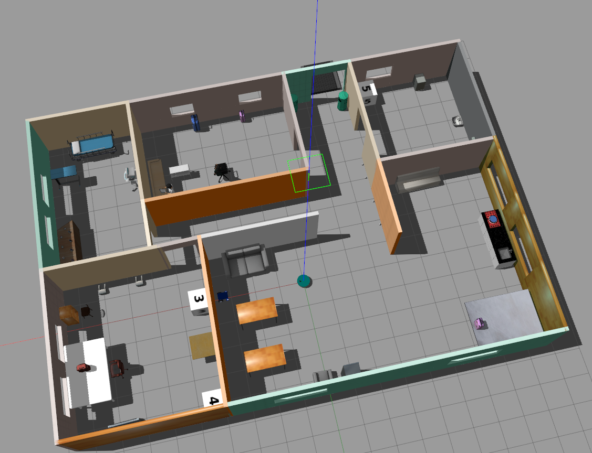
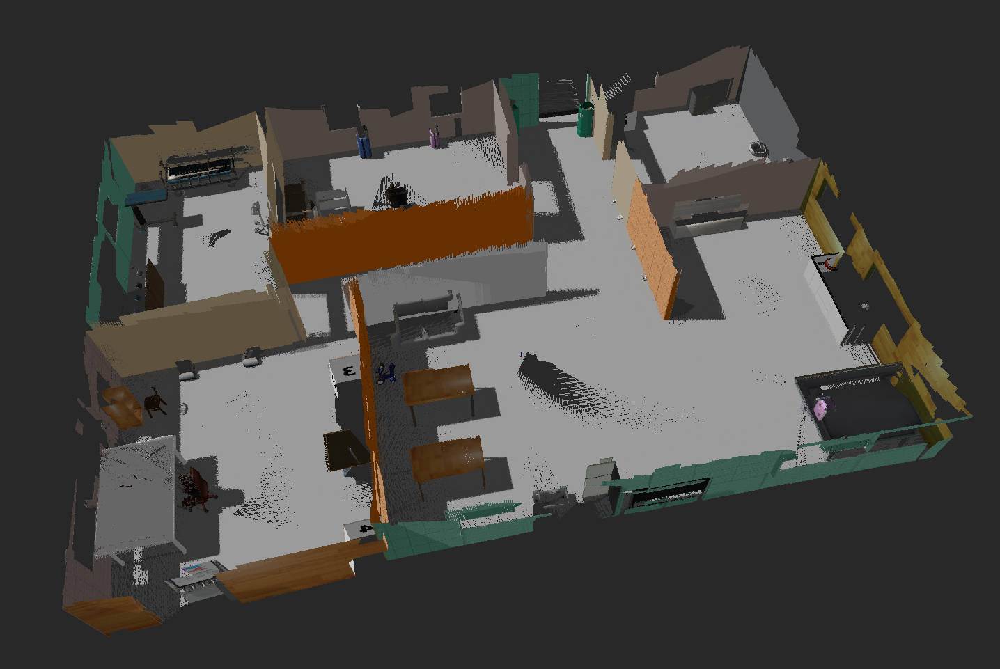
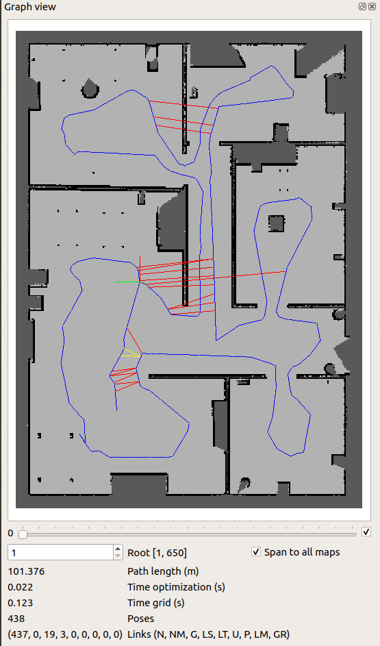
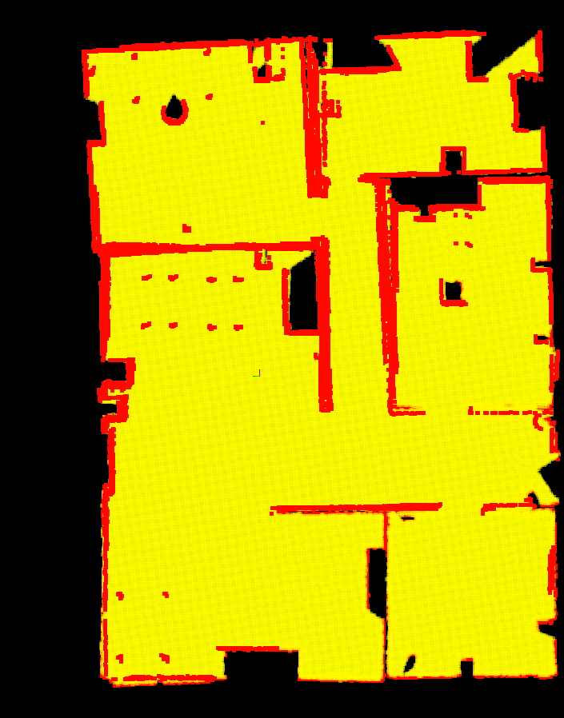

# Map My World
This project is aimed at demonstrating the use of RTAB-Map (a GraphSLAM based algorithm) package for simultaneous localization and mapping (SLAM) of a mobile robot in a environment. The repository consist of the following:

* A feature-rich Gazebo world and a mobile robot.
* ROS packages: [rtabmap_ros](http://wiki.ros.org/rtabmap_ros).

## Prerequisites
* ROS and Gazebo running on Linux.
* CMake and gcc/g++.
* Install `rtabmap_ros` package by using the following commands:
    ```
    $ sudo apt-get update
    $ sudo apt-get upgrade -y
    $ sudo apt-get install ros-<your distro>-rtabmap-ros
    ```

## Build
* Clone the repo to the src folder of your catkin workspace
    ```
    $ git clone https://github.com/yabdulra/Mapping-Using-RTAB-Map.git
    ```

    Follow [this](http://wiki.ros.org/catkin/Tutorials/create_a_workspace) guide to create a catkin workspace if you do not have one.
* Within the same src folder, clone the teleop package
    ```
    $ git clone https://github.com/ros-teleop/teleop_twist_keyboard
    ```
* Change directory to `catkin_ws` and build.
    ```
    $ cd ..
    $ catkin_make
    ```

## Launch
* Source your workspace and launch the simulation world.
    ```
    $ source devel/setup.bash
    $ roslaunch my_robot world.launch
    ```

* In a new terminal, source your workspace and launch the rtabmap package.
    ```
    $ source devel/setup.bash
    $ roslaunch my_robot mapping.launch
    ```

* In a new terminal. source your workspace and run the `teleop` node.
    ```
    $ source devel/setup.bash
    $ roslaunch my_robot teleop.launch
    ```
    Drive the robot around the world using the teleop keyboard to build a complete map of your world.

## Map visualization
When you are done generating the map, you can view it using the `rtabmap-databaseViewer` tool. It allows for complete analysis of your mapping session.
* Open the mapping database using the following:
    ```
    $ rtabmap-databaseViewer ~/.ros/rtabmap.db
    ```
* Add some windows to get a better view of the relevant information.
    - Say yes to using the database parameters
    - View -> Constraint View, to idebtify where and how to neighboring links and loop closures were created,
    - View -> Graph View, to view the 2D map, updated iteration, and the path of your robot,
    - View -> Occupancy Grid, to view the occupancy grid of your map,
    - Edit -> view 3D map... to view the 3D representation of your world.

Here is a view of the 3D-Map, 2D-Map, and Occupancy Grid generated from the world in this project.

<table style="width:75%">
  <tr> 
    <th><p>
           </a>
           <br>World
      </p>
    </th>
    <th><p>
           </a>
           <br>3D Map
        </p>
    </th>
  </tr>
  <tr>
    <th><p>
           </a>
           <br>2D Map
      </p>
    </th>
    <th><p>
           </a>
           <br>Occupancy Grid
      </p>
    </th>
  </tr>
</table>
